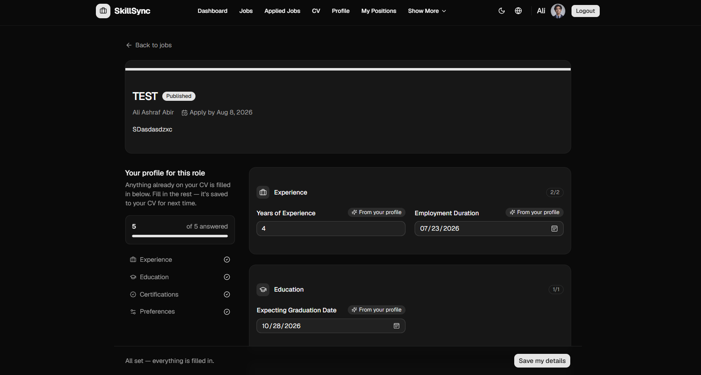
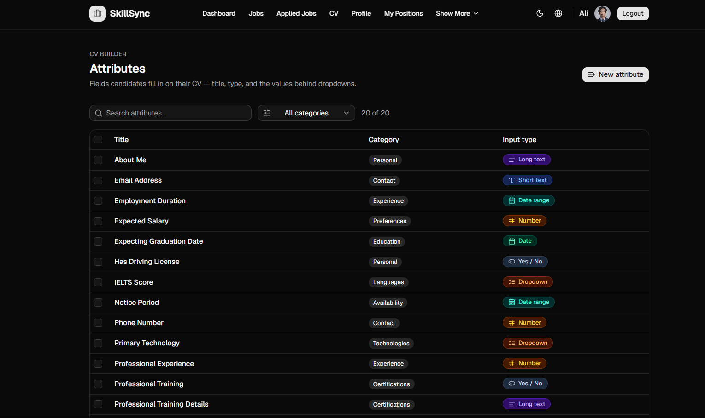
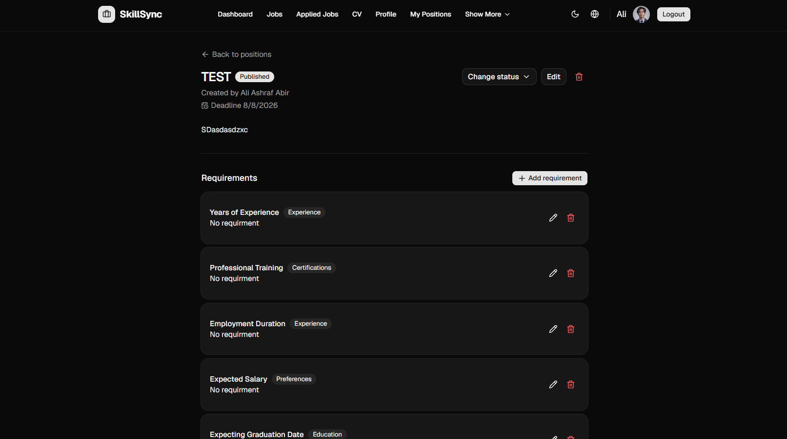
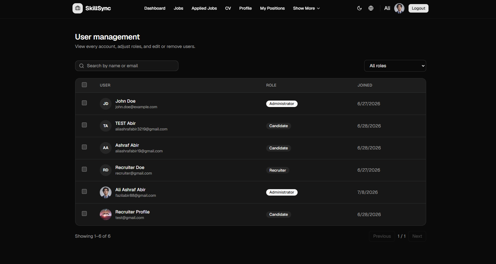
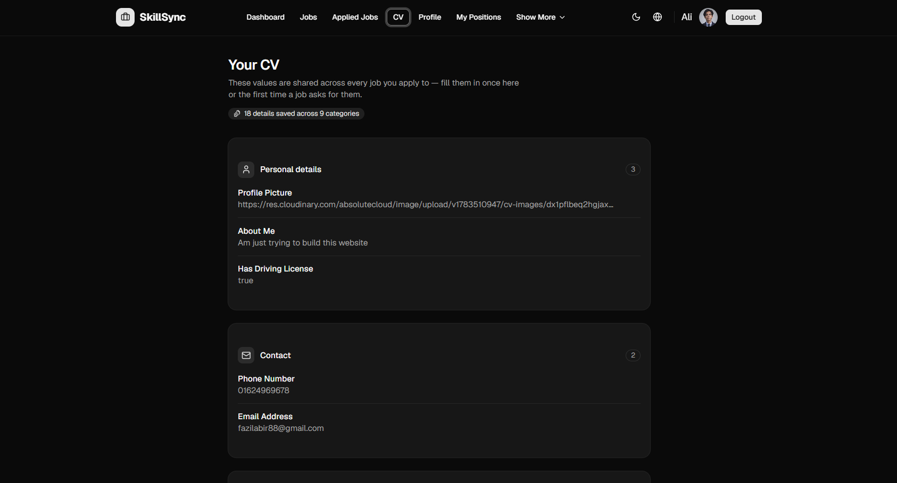

# SkillSync

SkillSync is a job platform that connects candidates and recruiters through a **structured, attribute-driven CV** instead of a static PDF. Recruiters define exactly what they need to know for a role — years of experience, certifications, driving license, expected salary, and so on — and candidates fill it in once on their profile and reuse it across every application.

## Features

### For candidates
- **Reusable CV** — personal details, contact info, experience, education, certifications, and preferences are saved once and auto-filled into every job application.
- **Per-job application forms** — each position only asks for what's still missing from the candidate's saved CV; everything else is pre-filled with a clear "From your profile" indicator.
- **Applied jobs tracking** — see the status of every application in one place.

### For recruiters
- **Position management** — create, edit, publish, close, and archive job postings with a controlled status lifecycle (Draft → Published → Closed/Archived).
- **Custom requirements per position** — attach requirements to a position (e.g. "3+ years experience", "IELTS score above 7") built from a searchable attribute picker, with operators (equals, between, in, greater/less than, etc.) tailored to each attribute's data type.
- **Attribute library** — a shared, reusable set of CV fields (short text, long text, number, date, date range, yes/no, dropdown) organized by category (Personal, Contact, Experience, Education, Certifications, Preferences, Technologies, Languages, Availability), searchable and filterable.
- **Ownership & permissions** — recruiters manage the positions they created; administrators can manage all positions.

### For administrators
- **User management** — view every account, search by name or email, filter by role, and edit, delete, or bulk-manage users and their roles.
- **Full attribute and position oversight** across all recruiters.

### General
- Role-based access control (Administrator, Recruiter, Candidate)
- Dark / light mode
- Multi-language support (locale switcher)
- Optimistic UI updates with toast notifications for success/error states
- Responsive, accessible UI built with reusable form, dialog, and table components

## Tech stack

**Frontend**
- Next.js (App Router) + TypeScript
- Tailwind CSS with [shadcn/ui](https://ui.shadcn.com/) components
- `react-hook-form` + `zod` for form state and validation
- `next-intl` for internationalization
- `sonner` for toast notifications

**Backend**
- ASP.NET Core Web API (C#)
- Entity Framework Core
- PostgreSQL (full-text search on attributes via `tsvector`)
- Role-based authorization with optimistic concurrency (version-based conflict detection on updates)

## Screenshots


### Candidate application view
Auto-filled application form showing profile-sourced fields and remaining questions.



### Attribute library
The shared set of CV fields recruiters can attach to positions as requirements.



### Position detail & requirements
A single job posting with its status, ownership, and attached requirements.



### User management
Admin view for managing accounts and roles across the platform.



### Candidate CV
A candidate's saved profile, reused across every application.



## Getting started

### Prerequisites
- Node.js 18+
- .NET 8 SDK
- PostgreSQL

### Backend
```bash
cd backend
dotnet restore
dotnet ef database update
dotnet run
```

### Frontend
```bash
cd frontend
npm install
npm run dev
```

Then open [http://localhost:3000](http://localhost:3000).

## Roles

| Role          | Permissions                                                                 |
|---------------|------------------------------------------------------------------------------|
| Candidate     | Build a CV, browse and apply to positions, track applications               |
| Recruiter     | Create/manage their own positions, attach requirements, view applicants     |
| Administrator | Full access — manage all positions, attributes, and user accounts/roles     |

## License
